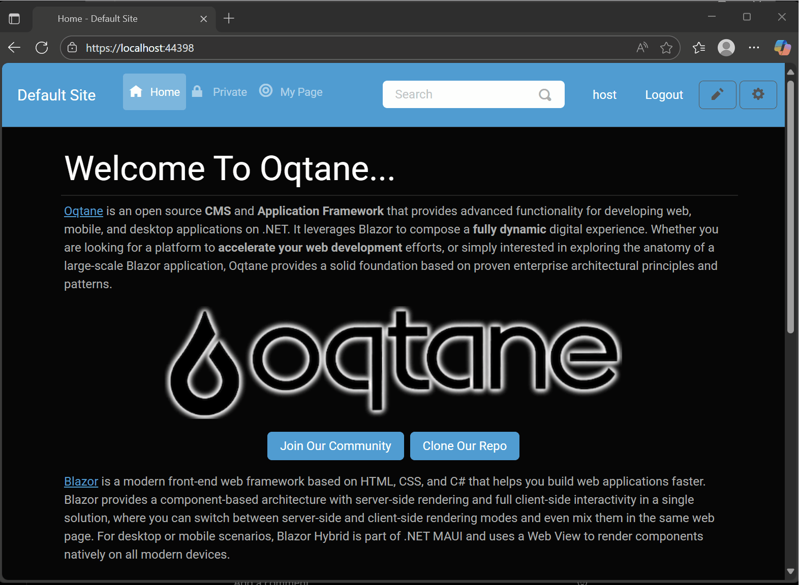
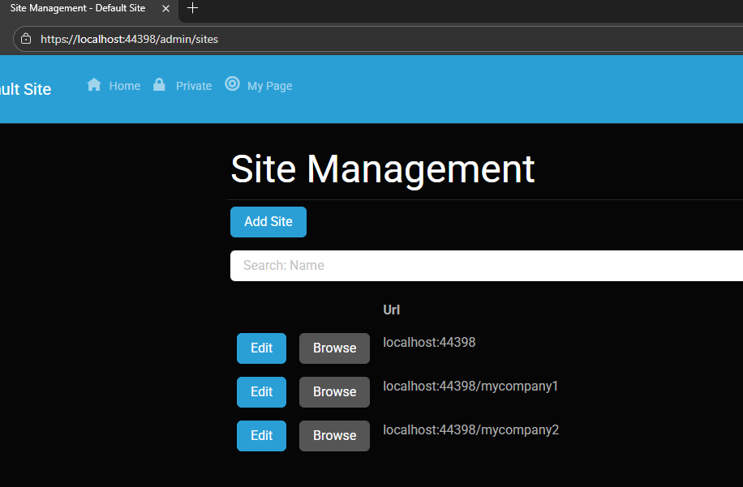
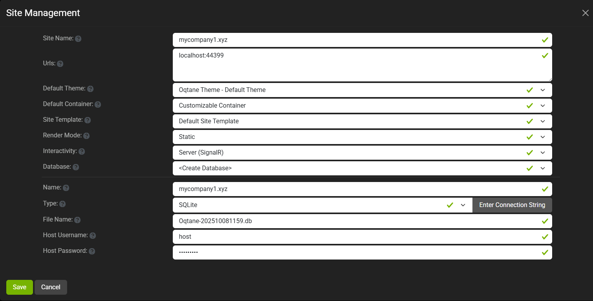
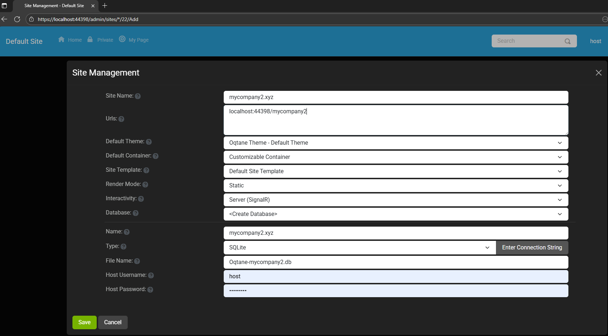

# Oqtane Multi-Tenant Application Template

The solution also contains Client, Server, and Shared folders which is where you you would implement your custom functionality. An example module and theme are included for reference, and you can add additional modules and themes within the same projects by following the standard Oqtane folder/namespace conventions.

## Multi-Tenant Configuration

This template demonstrates a complete multi-tenant setup with three separate sites:

### 1. Host Site
- **Database**: `Oqtane-host.db`
- **Purpose**: The main host site that manages the overall application

### 2. Company 1 Site
- **Database**: `Oqtane-mycompany1.db`
- **Alias**: `mycompany1.xyz`
- **Purpose**: Tenant-specific site for Company 1

### 3. Company 2 Site
- **Database**: `Oqtane-mycompany2.db`
- **Alias**: `mycompany2.xyz`
- **Purpose**: Tenant-specific site for Company 2

## Application Settings

*Note: Only the host site was originally configured in the `appsettings.json` file. Both Company 1 and Company 2 tenant sites were created and configured using the administration panel of the host site after the initial installation.*

The multi-tenant configuration is defined in `Server/appsettings.json`:

```json
{
  "RenderMode": "Static",
  "Runtime": "Server",
  "Database": {
    "DefaultDBType": "Oqtane.Database.Sqlite.SqliteDatabase, Oqtane.Server"
  },
  "ConnectionStrings": {
    "DefaultConnection": "Data Source=Oqtane-host.db;",
    "mycompany1.xyz": "Data Source=Oqtane-mycompany1.db;",
    "mycompany2.xyz": "Data Source=Oqtane-mycompany2.db;"
  },
  "Installation": {
    "DefaultAlias": "https://localhost:44398",
    "HostPassword": "Oqtane!16",
    "HostEmail": "demo@demo.com",
    "SiteTemplate": "",
    "DefaultTheme": "",
    "DefaultContainer": ""
  },
  "Localization": {
    "DefaultCulture": "en"
  }
}
```

## Tenant Switching Demo

### Multi-Tenant Navigation


The above GIF demonstrates how users can seamlessly switch between different tenant sites within the same Oqtane application. This shows:

- **Host Site Access**: Access to the main host administration
- **Tenant Switching**: Easy navigation between Company 1 and Company 2 sites
- **Isolated Environments**: Each tenant maintains its own separate data and configuration
- **Unified Interface**: Consistent user experience across all tenants

## Site Configuration Screenshots

### Site Settings Configuration


The Site Settings screenshot shows the general configuration for the multi-tenant setup, including:
- Host site configuration
- Tenant site management
- Database separation
- Site aliases and routing

### Company 1 Settings


*Note: The Company 1 screenshot above shows the configuration before the URL was fully configured. The actual URL should include the "mycompany1" suffix as specified in the connection strings (mycompany1.xyz). Please compare this with the Company 2 screenshot to understand the complete tenant configuration.*

The Company 1 settings screenshot demonstrates:
- Tenant-specific configuration
- Custom branding and settings
- Site-specific module configurations
- User and role management for Company 1

### Company 2 Settings


The Company 2 settings screenshot shows:
- Separate tenant configuration
- Different branding and settings
- Site-specific module configurations
- User and role management for Company 2

## Database Structure

The multi-tenant implementation uses separate SQLite databases for each tenant:

```
Server/Data/
├── Oqtane-host.db          # Host site database
├── Oqtane-mycompany1.db    # Company 1 tenant database
├── Oqtane-mycompany2.db    # Company 2 tenant database
└── *.db-shm, *.db-wal      # SQLite WAL files
```

## Key Features

- **Multi-Tenant Architecture**: Each tenant has its own database and configuration
- **Tenant Isolation**: Complete separation of data between tenants
- **Centralized Management**: Host site manages all tenant configurations
- **Customizable Settings**: Each tenant can have its own theme, modules, and settings
- **Scalable Design**: Easy to add new tenants by adding connection strings

## Implementation Details

The multi-tenant functionality is implemented through:

1. **Connection String Mapping**: Each tenant alias maps to a specific database
2. **Tenant Resolution**: Oqtane automatically routes requests to the appropriate database based on the site alias
3. **Site Management**: Host site administrators can manage all tenant sites
4. **Module Sharing**: Modules can be shared across tenants while maintaining tenant-specific data


